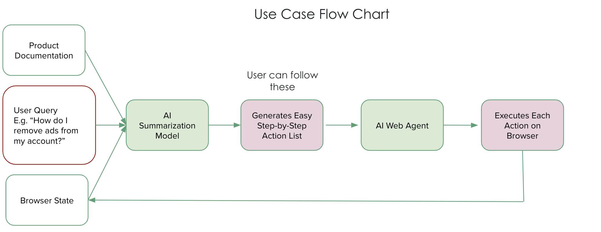

## Project Template

### QuizLLMs: A Model for generating flash cards from text [To be Updated]

Develop an app that utilizes LLMs to parse a long text of a specific topic and generate interactive flashcards for effective learning for people.

## Quick start

### Pre-requisites

Install the libraries

```
pip install -r requirements.txt
```

### Run [To be Ran]

```
python main.py -e basic
```

## Next TODO Items [To be Updated]

- [] Replace the current summarization method with one that uses GPT-3.5
- [] Create a script to visualize the results for multiple experiments

## Project Structure [To be Updated]

- `data` contains anything related to data
- `scripts` contains all kinds of standalone python and notebook scripts including visualizatin scripts 
- `results` contains results that were saved from the experiments
- `exp_configs` contains the hyperparameters (or arguments) of the experiment.
- `src` contains the functions/objects needed to run the main experiments.


## Expected Pipeline [To Be Updated]

This defines how the control flow works for the project, and this is expected to be refined as the prooject goes on.



## Timeline [To Be Updated]

Tailer the timeline to be more specific for your project

- Week 1: define project, pipeline, and responsiblities
- Week 2: 
- Week 3:
- Week 4:
- Week 5:

## Contributers

- Issam Laradji 
    - A Facilitator and a Coder who will be working on defining relevant templates and related script examples


