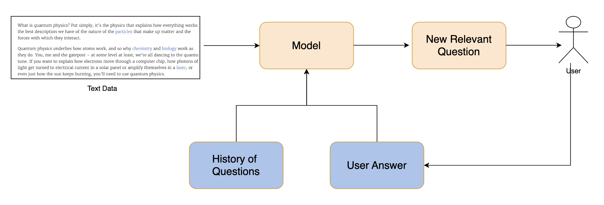

## Team 3: Insights.ai

## 1. Project Description

### Insights.AI app: a demo app to generate deep business intelligence insights from publicly available info 

Develop an app for small businesses that utilizes LLMs to parse job postings from other companies to generate tables and charts about potential competitors and competitive positioning info.

#### Control Flow

- **Expected Input:** The user provides a text file about their company (products, services, org info) and a link or list of links to companies. 
- **Expected Pipeline:** A model will parse the text. A query is sent to GPT3.5 LLM. Then generate outputs
- **Output:** The output is a table and chart with insights about potential areas to dig into


#### Experimental Setup [To be Updated]
Here we specify what we need to have our project code running.

- **Dataset:** The wikipedia dataset (https://paperswithcode.com/dataset/wiki-en)
- **Models to be used**: GPT-4/GPT-3.5, Llama, or Mistral
- **Evaluation Metric:** Human Evaluation, or G-Eval (https://arxiv.org/abs/2303.16634)


### Related Work [To be Updated]

- Chain of Thought prompting (https://arxiv.org/abs/2201.11903)
- Text summarization with pretrained encoders (https://arxiv.org/pdf/1908.08345.pdf)

## 2 Quick start [To be Run]

### Pre-requisites

Install the libraries

```
pip install -r requirements.txt
```

### Run 

```
python main.py -e basic
```

### Code Structure [To be Updated]

- `data` contains anything related to data
- `scripts` contains all kinds of standalone python and notebook scripts including visualizatin scripts 
- `results` contains results that were saved from the experiments
- `exp_configs` contains the hyperparameters (or arguments) of the experiment.
- `src` contains the functions/objects needed to run the main experiments.

- 

## Figure Pipeline [To Be Updated]




## Table of Results [To Be Updated]

### Quantitive Results [To be Updated]

Here we compare different methods based on the G-Eval metric scores.

|          | Dataset 1 | Dataset 2 |
|----------|-----------|-----------|
| Method 1 |    10     |    20     |
| Method 2 |    15     |    25     |
| Method 3 |    12     |    18     |


### Qualitative Results [To be Updated]

Here we compare different methods based on where they get things right, and wronge

|          |  Good Cases  | Failure Cases   |
|----------|-----------|-----------|
| Method 1 |    Who is santa clause? Saint Nicholas      |    Who is santa clause? Michael Jackson     |
| Method 2 |    x     |    x     |
| Method 3 |    x     |    x     |


## Next TODO Items 

**Task List**
- Please refer to https://docs.google.com/spreadsheets/d/13_ml3JDSE_b-86nSrkGnwPIKQjcrvHbaXODFqQLDIMg/edit#gid=0


## Contributors [To be Updated]
| Name            | Role                                   | What to work on?                                                |
|-----------------|----------------------------------------|------------------------------------------------------------------|
| Sarah           | Facilitator                            | research competitors, define business problem, facilitate        |
| Ameer           | Data Analyst                           |                                                                  |
| Guri            | Coder (FE)                             |                                                                  |
| Dani            | Data Analyst                           |                                                                  |
| Anna            | Coder (ML Engineer)                    |                                                                  |


